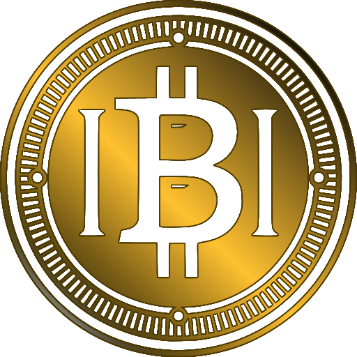

<p align="center">
  
</p>

<h1 align="center">IBITIcoin</h1>

<p align="center">
  Multi-module DeFi ecosystem on BNB Smart Chain (BEP-20)
</p>

---

> ⚠️ **Disclaimer**  
> This repository is intended for developers, auditors and integrators.  
> Nothing in this repo is financial advice or an investment recommendation.

---

## Overview

**IBITIcoin** is a multi-module DeFi ecosystem built on **BNB Smart Chain**.  
The system combines:

- The main IBITI token (BEP-20, 8 decimals)
- Phased token sale with fallback mode
- Fixed-term staking with NFT rewards
- NFT-based fee / price discounts
- Dynamic fee manager
- On-chain DAO module
- Public frontend: website, shop, staking dashboard, NFT gallery

This repository contains the **public frontend** (static HTML/CSS/JS) for ibiticoin.com  
and the connected dashboards that interact with the on-chain contracts.

---

## Key links

- **Website:** https://ibiticoin.com  
- **Frontend (GitHub Pages):** https://vovan1980.github.io/ibiticoin.github.io  
- **Main token (BSC):** `0x47F2FFCb164b2EeCCfb7eC436Dfb3637a457B9bb`  
- **Decimals:** `8`

---

## Repositories

### Smart contracts / core protocol

> Full Solidity sources (token, sale, staking, NFTs, DAO, etc.)

- `IBITIcoin.sol` – main BEP-20 token  
- `PhasedTokenSale.sol` – multi-phase token sale with fallback mode  
- `StakingModule.sol` – fixed-term staking (1–12 months), penalties, rewards  
- `NFTDiscount.sol` / `IBITINFT.sol` – NFT discount logic and NFT collection  
- `FeeManager.sol` – dynamic fees, activity tracking, volatility tiers  
- `DAOModule.sol` / `DAOModuleImplementation.sol` – on-chain DAO  
- `TeamVesting.sol` – team / founder vesting  
- plus helper contracts (oracles, mocks, buyback, bridge, etc.)

> See the dedicated **IBITIcoin-core** repository for the full contract set and tests.

### Frontend & landing (this repo)

This repository contains:

- Public landing pages (RU/EN)
- Token sale dashboard & statistics
- Staking dashboard
- NFT gallery & discount information
- Shop integration (IBITI / USDT via PancakeSwap)
- Legal pages (privacy, terms, comment policy, etc.)

Static stack: **HTML + CSS + vanilla JS** (no backend).

---

## Main features

### IBITI Token (BEP-20)

- Deployed on **BNB Smart Chain mainnet**
- `8` decimals
- Integrated with:
  - `FeeManager` (dynamic buy/sell fees)
  - `StakingModule` (locking & rewards)
  - `NFTDiscount` (fee / price discounts for NFT holders)

### Phased token sale

- Multiple sale phases with fixed prices and caps  
- Automatic **fallback sale mode** once planned phases are finished  
- Referral / bonus pools managed on-chain  

### Staking module

- Fixed-term staking from **1 to 12 months**
- Increasing reward rate for longer lock periods  
- Penalties / reduced rewards for early unstake  
- NFT rewards for long-term and loyal stakers

### NFT discounts

- IBITI NFT collection with different rarity levels (1%, 3%, 5%, 7%, 10%, 15%, 25%, 50%, 75%, 100%, 100% FUL)  
- Discount level is bound to NFT rarity and enforced by `NFTDiscount` + `IBITINFT` contracts  
- Can influence:
  - trading fees
  - sale price / bonuses
  - staking or referral rewards (configurable on contract side)

### Dynamic fees (FeeManager)

- Base buy / sell fees with flexible configuration  
- Activity tracking and **volatility tiers**  
- Optional boosting / reduction based on:
  - market conditions
  - user behaviour
  - NFT ownership

### DAO module

- On-chain proposals & voting  
- Thresholds to avoid spam proposals  
- Optional NFT / token rewards for voters  
- Pausable, upgradable logic via `DAOModuleImplementation`

---

## Local development

### Prerequisites

- **Node.js** 18+  
- **npm** or **yarn**  
- (optional) **hardhat** and **pnpm** for contract work  
- BSC RPC endpoint (e.g. Ankr / public BSC node)  
- Private key and API keys in a local `.env` file (never commit it)

Example `.env` for contracts:

```env
BSC_ARCHIVE_RPC_URL="https://..."
BSC_RPC_URL="https://data-seed-prebsc-1-s1.binance.org:8545/"
BSC_MAINNET_RPC_URL="https://bsc-dataseed1.bnbchain.org"

PRIVATE_KEY="0x..."
FOUNDER_WALLET="0x..."
BSCSCAN_API_KEY="..."
COINMARKETCAP_API_KEY="..."
Frontend: install & run
bash
Копировать код
# clone repo
git clone https://github.com/VOVAN1980/ibiticoin.github.io.git
cd ibiticoin.github.io

# run simple static server (example)
npx serve .
# then open http://localhost:3000 (порт может отличаться)
The site is fully static, so any other local static server also works.

Contracts (example workflow)
bash
Копировать код
cd contracts
npm install

# compile
npx hardhat compile

# run tests
npx hardhat test

# deploy to BSC testnet (example)
npx hardhat run --network bscTestnet scripts/deploy_full.js
Concrete deploy scripts and parameters live in the core contracts repository.

Security
See SECURITY.md for:

responsible disclosure rules

testing guidelines

how to report a vulnerability (email / PGP if applicable)

Never test on mainnet with real funds unless you understand the risks.

License
Source code
All application and smart-contract code in this repository is licensed under the:

MIT License – see LICENSE

You are free to use, copy, modify, merge, publish, distribute, sublicense and/or sell copies of the software, under the terms of the MIT license.

Brand, logo & NFTs
The following are not covered by the MIT license:

The IBITIcoin and IBITI names and brand

Logos, visual identity and design elements

All NFT artwork files (images in /img and related media)

These assets are protected and governed by:

LICENSE_TECHNOLOGY.md

LICENSE_OVERVIEW.md

In short: the code is open, but the brand and artwork remain under controlled use.
For partnerships, integrations or media usage of the IBITI brand, please contact:

info@ibiticoin.com
